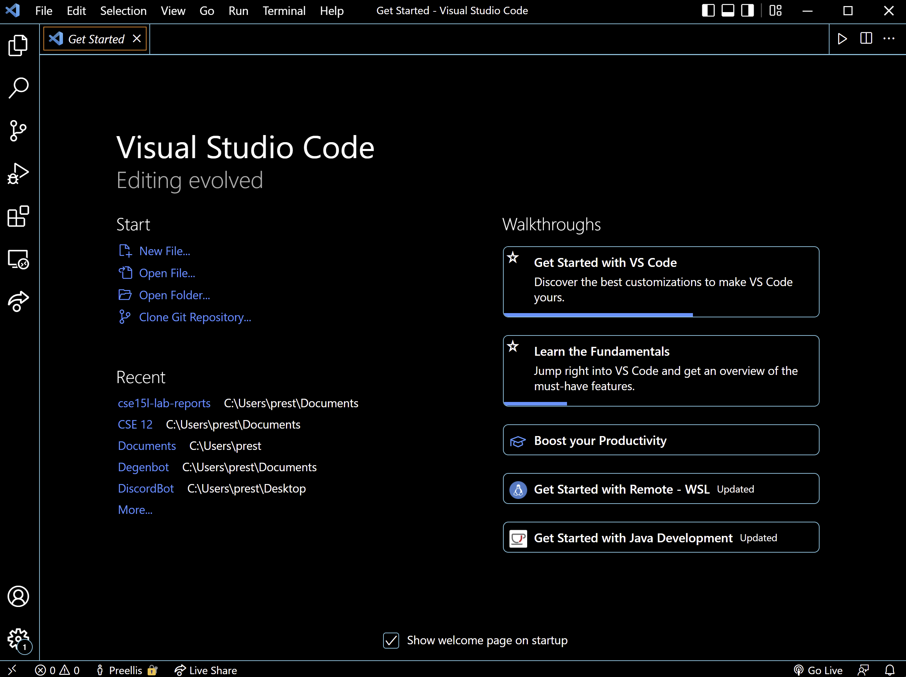

# Lab Report 1 Week 2
---
## Installing VS Code
Download the VSCode version appropriate to your computer [here](https://code.visualstudio.com/Download). Follow the instalation instructions and open it to be greeted with something that looks like the screenshot below.

## Remotely Connecting
I already had it but you may need to download Open SSH [here](https://docs.microsoft.com/en-us/windows-server/administration/openssh/openssh_install_firstuse). Next find your username for your cse15l account [here](https://sdacs.ucsd.edu/~icc/index.php). Type `ssh cs15lsp22<username>@ieng6.ucsd.edu` into terminal, say yes if needed, then login with your password to get to the following output.

## Trying Some Commands
Below are some useful commands from the writeup.
* `cd ~`
* `cd`
* `ls -lat`
* `ls -a`
* `ls <directory>` 
* `cp <from> <to>`
* `cat <file path>`

For example, I ran `cd ~` and got the following output. 


It moves you to your home directory.

## Moving Files with scp

I made a very basic java file called WhereAmI.java. Then I used the following command `scp <relative file path> <destination server>:<location>` and entered my password to move it to the remote server.


## Setting an SSH Key

In order to avoid typing in a password so often, I had to setup an SSH Key following the commands below

```
ssh-keygen -t ed25519
ssh cs15lsp22zz@ieng6.ucsd.edu
mkdir .ssh
exit
scp /Users/prest/.ssh/id_rsa.pub cs15lsp22aii@ieng6.ucsd.edu:~/.ssh/authorized_keys
```

*Note: after key gen copy the file path seen press enter and then press enter to skip the passphrase creation*

As you can see below now I can login without putting a password which saves a lot of time when testing files.

## Optimizing Remote Running
To save time I came up with the following process to update a file quickly on the remote server and run it. The file name can be changed to whatever is desired. The SSH key should already be set up in order to avoid typing in passwords.

Process:
* Ctrl + s to save
* Click on terminal
* Ctrl+s the command below with the correct ID (or up arrow if it was the last command used)
* `scp WhereAmI.java cs15lsp22aii@ieng6.ucsd.edu:~/;  ssh cs15lsp22aii@ieng6.ucsd.edu "javac WhereAmI.java; java WhereAmI"`
* Press Enter
* Wait

Below is the main command **in action!!!**


