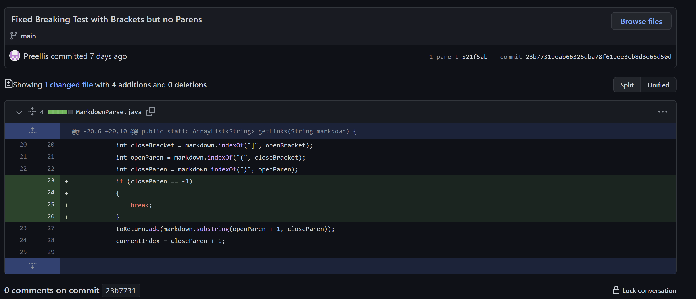
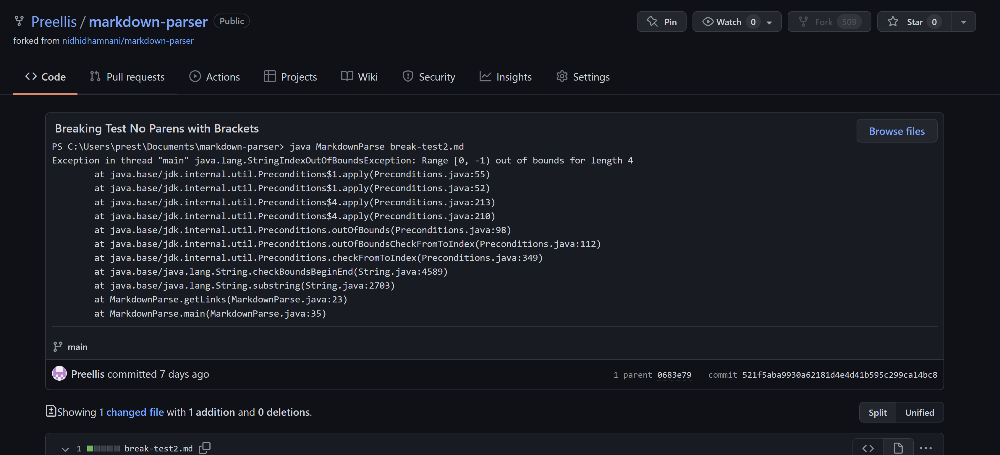
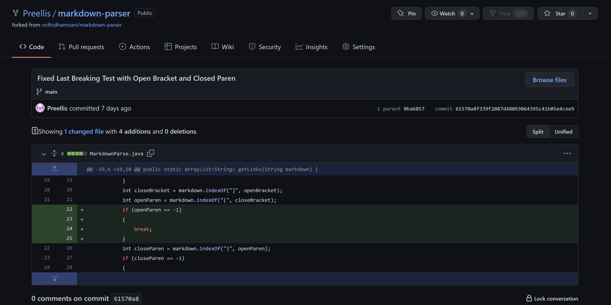
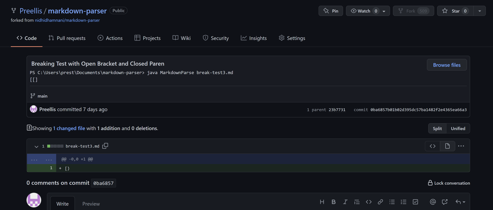
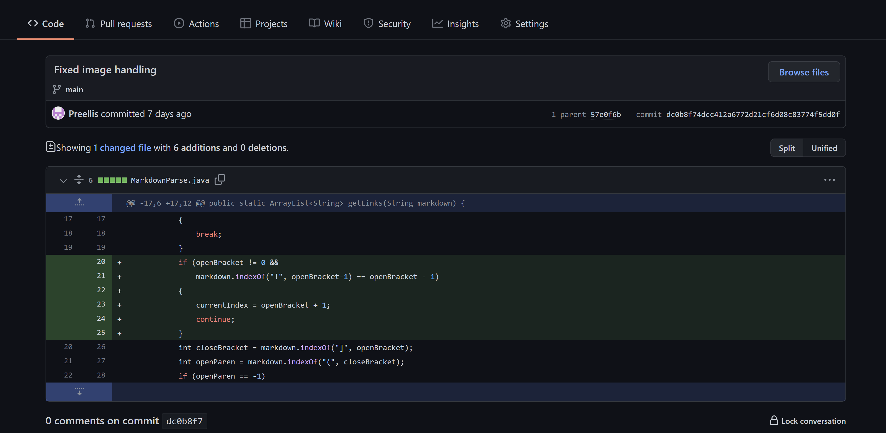
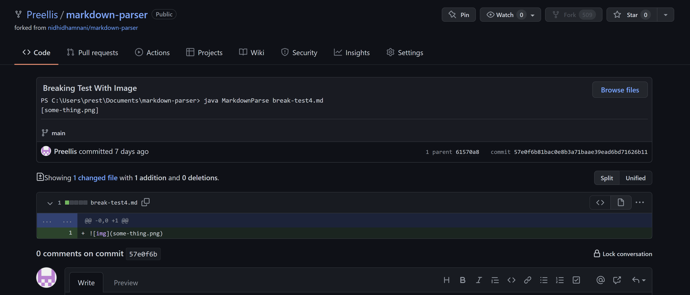

# Lab Report 2 Week 4
---
## First Code Change
### Changed Code

### Test File
[First Test File](https://github.com/Preellis/markdown-parser/blob/main/break-test2.md)

### Broken output

### Explanation
The bug was that the program failed to check if there was actually a close paren after seeing brackets. Since the input file had no parentheses but had brackets, the close paren index became negative 1 which caused the symptom of index out of bounds when trying to get the link from the file.
## Second Code Change
### Changed Code

### Test File
[Second Test File](https://github.com/Preellis/markdown-parser/blob/main/break-test3.md)
### Broken output

### Explanation
The bug was a failure to check of the existence of an open parentheses. As a result, since the input file had no open parenthesis but had an open and closed parenthesis the link was gotten from index -1 to the close parenthesis position which resulted in the symptom of an incorrect link when no correctly formmated link was present in the test file.
## Third Code Change
### Changed Code

### Test File
[Third Test File](https://github.com/Preellis/markdown-parser/blob/main/break-test4.md)
### Broken output

### Explanation
The bug was that the code failed to check for exclamation points before the brackets which would indicate an image instead of a link. As a result, since the input file had an image component there was a symptom of an extra link in the output eventhough no actual links were in the test file.