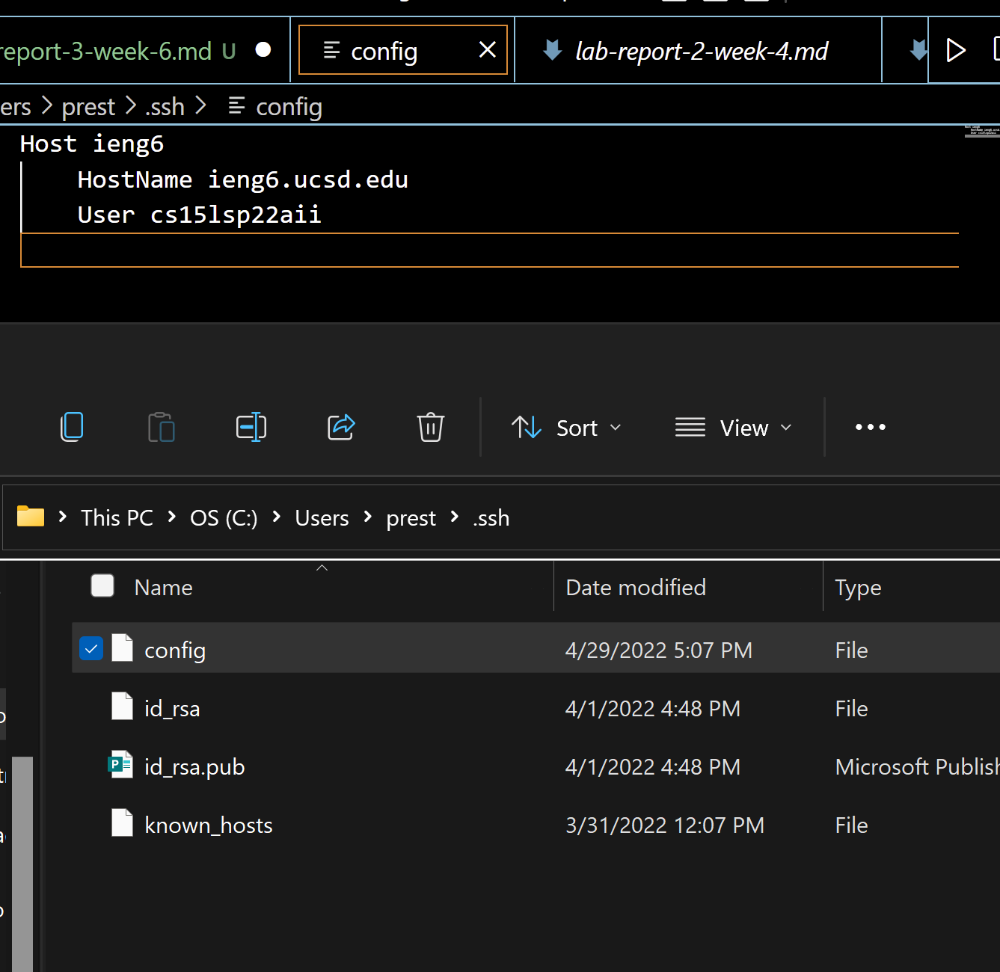
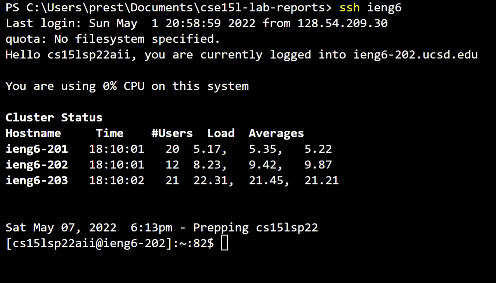
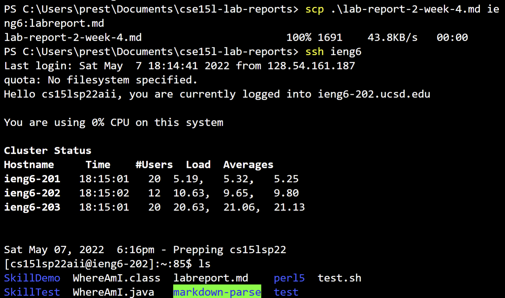
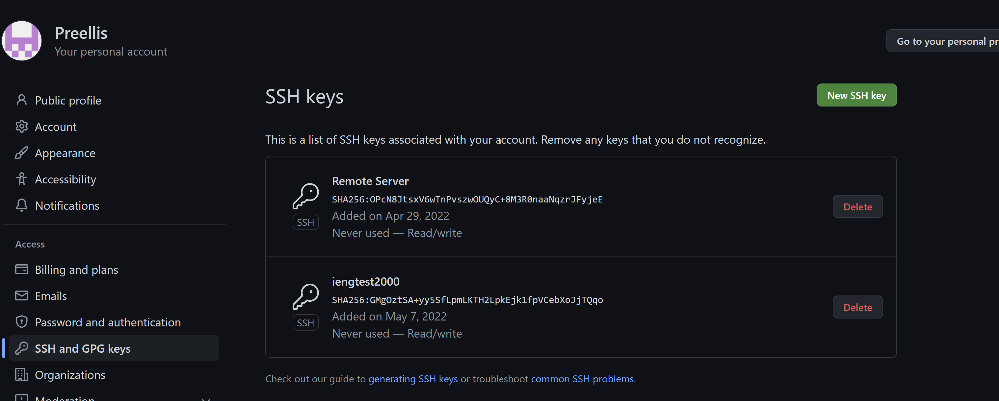
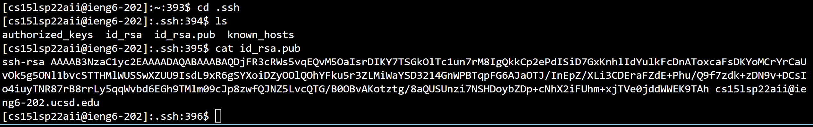
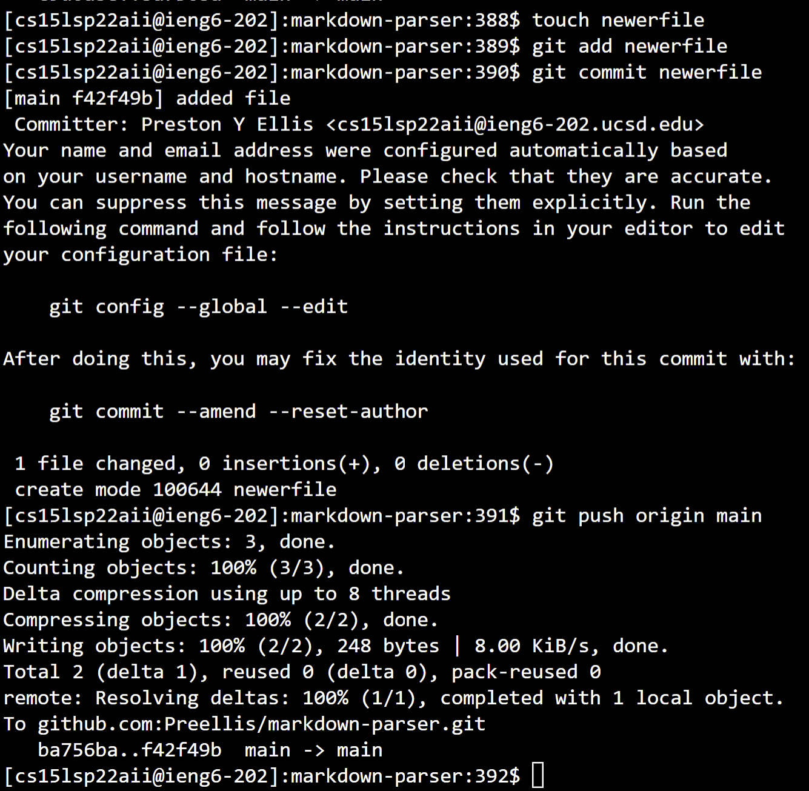
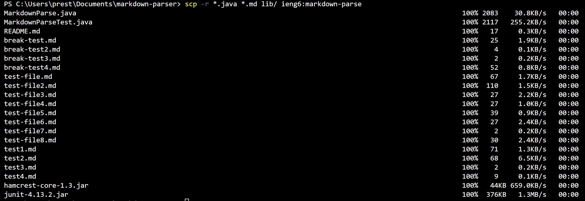
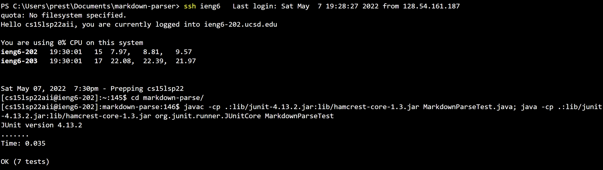
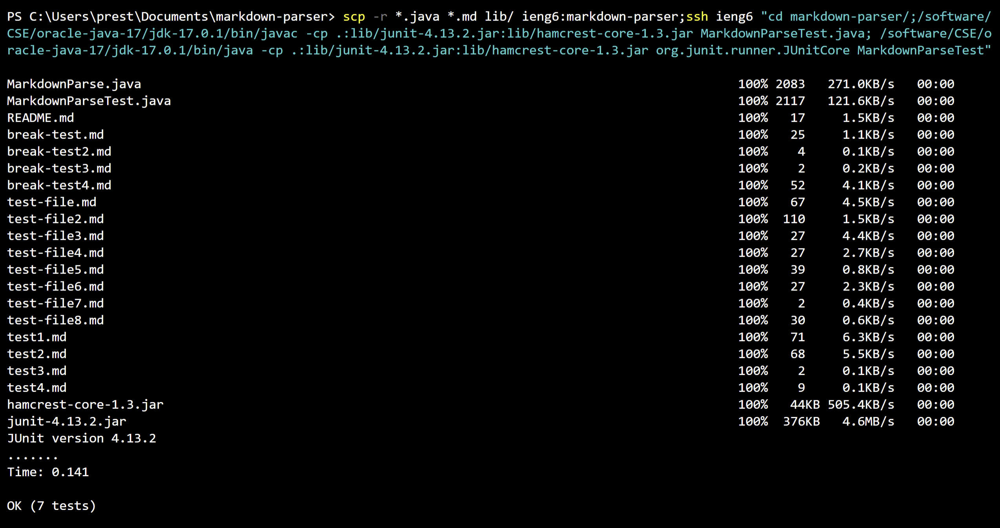

# Lab Report 3 Week 6
---
## Streamlining ssh Configuration
By setting up the config in the .ssh folder in my home directory using VSCode as shown below, I could use "ieng6" to connect without a password or typing out the full hostname.

As you can see below now it is no longer necessary to type in the password, and it automatically logs in.

The change also allows me to use "ieng6" as the hostname so that I can scp without typing out a password either as shown below.

## Setup Github Access from ieng6
We can do a similar thing with ssh keys to auto login to github and push changes. In fact, a username and password cannot even be used for github on the remote server. To do this I used `ssh-keygen` to create a public and private key and then added the public key to github as shown below.

Below is my public key and the location of the public and private keys in the .ssh folder in my home directory on the remote server.

Since the public key was added to github, I can now push changes to a repository without loging in as shown below. Note that when creating the repo it must be with the ssh clone or you will have to use `git remote set-url origin` to change it to allow ssh login.

[Link to Commit](https://github.com/Preellis/markdown-parser/commit/f42f49bb6d50e58edfa3874ea77d1a4a197c82a5)

## Copy whole directories with scp -r
Instead of copying files one by one we can use `scp -r` to copy multiple. I used `scp -r *.java *.md lib/ ieng6:markdown-parse` while in my markdown parser folder so that I would avoid copying over git files and the class files.

After copying over the files, I can go onto the remote server and run the tests using the library files I also copied over.

In fact, this entire process can be run in one line but `java` and `javac` must be replaced by `/software/CSE/oracle-java-17/jdk-17.0.1/bin/java` and `/software/CSE/oracle-java-17/jdk-17.0.1/bin/javac` as shown below or the tests will fail to run.
