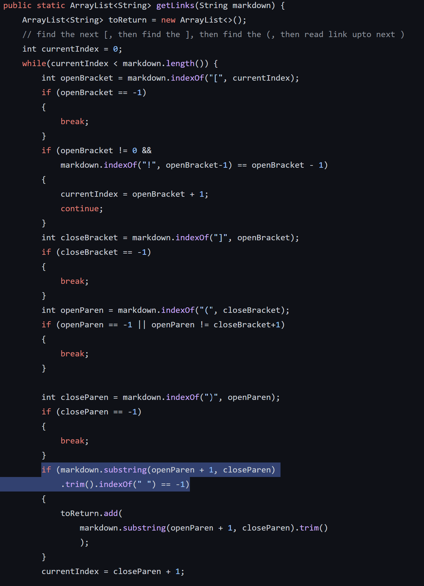

# Lab Report 5 Week 10
---
## How to find differing tests
On the remote server, we ran the following bash script for the different implementations to get the outputs of each test file.
```
for file in test-files/*.md;
do
  echo $file
  java MarkdownParse $file
done
```

We used the command `bash script.sh > results.txt` to store the results in an output file.

To compare the files we used the `vimdiff` command as seen below which shows both outputs and highlights differences in purple.
```
vimdiff markdown-parser/results.txt cse15lsp22-markdown-parser/results.txt
```

## Test #489
[Link](https://github.com/nidhidhamnani/markdown-parser/blob/main/test-files/489.md)


(our version on left, public version on right)

For test 489.md it should have had no links as the link was split between lines. The other parser successfully gave no links, but ours ouputed [foo\nbar].


The issue is that the code we have accepts links that have line breaks in them. There should be an extra check for index of `\n` to be -1 in the highlighted section so that links with line breaks are rejected.
## Test #573
[Link](https://github.com/nidhidhamnani/markdown-parser/blob/main/test-files/573.md)


(our version on left, public version on right)

For test 573.md it should have had just an image which means an empty link array. We got an empty array but the other parser got [/url] which is incorrect.


The issue with the public version is that there is no check for exclamation points before the opening bracket as that would indicate a photo instead of a link. In order to fix this we could add a check into the highlighted portion of the code that the character before the openbracket is not an exclamation point.